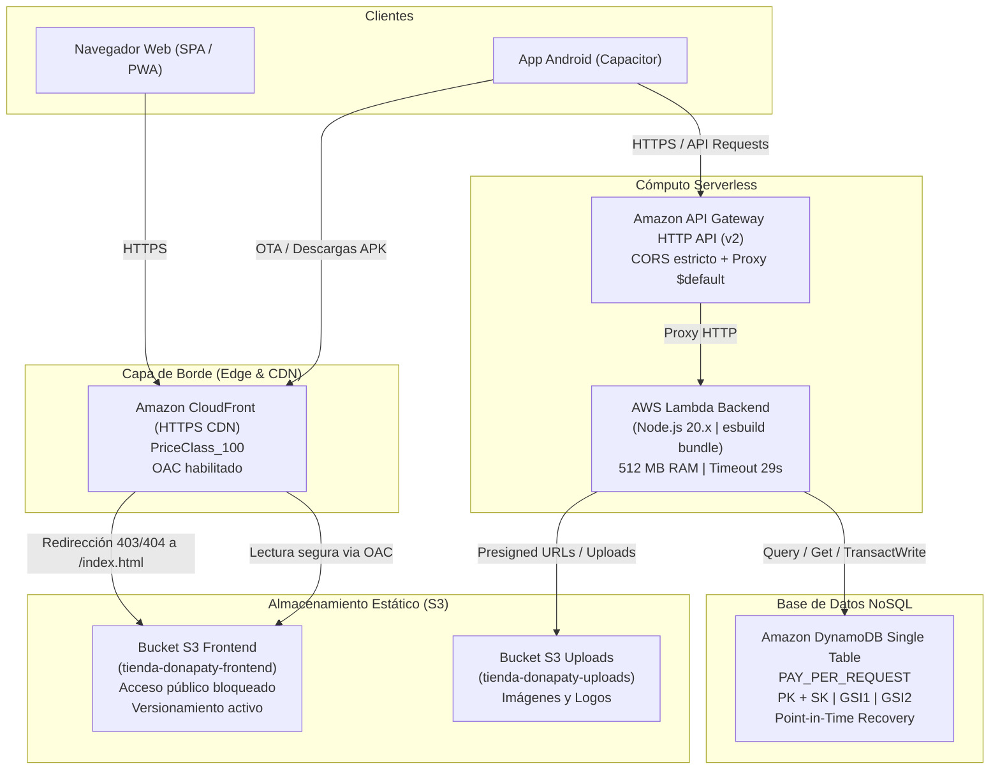
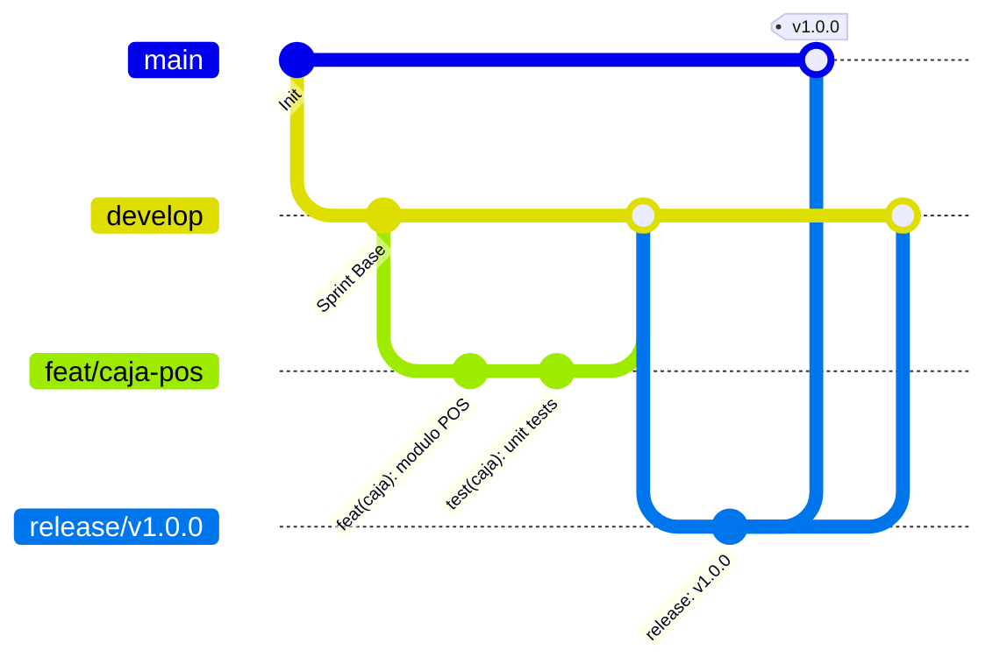

# Tienda Doña Paty — Manual de Arquitectura, Infraestructura y Estándares de Ingeniería

Este documento reúne las directrices técnicas, arquitectura de infraestructura en AWS, modelo de persistencia en DynamoDB (Single Table Design), pipelines de despliegue automatizado, reglas de control de versiones con Git y la integración institucional con GitHub CLI (`gh`).

---

## 1. Visión General del Proyecto

**Tienda Doña Paty** es una solución integral de punto de venta (POS), catálogo digital y gestión de pedidos multiplataforma (Web SPA/PWA y Móvil Android nativo con Capacitor) impulsada por una arquitectura 100% Serverless en la nube de Amazon Web Services (AWS).

### Stack Tecnológico Principal

* **Frontend**: Angular 20, Ionic Framework 8, Capacitor 8, TailwindCSS, SCSS.
* **Capacidades Móviles / PWA**: Escaneo de códigos de barra/QR con MLKit y polyfill Web, almacenamiento local y sincronización offline con SQLite (`@capacitor-community/sqlite` y `jeep-sqlite`), actualizaciones en vivo Over-The-Air (OTA) con Capgo (`@capgo/capacitor-updater`), notificaciones push vía Firebase Cloud Messaging (FCM), inicio de sesión social con Google.
* **Backend**: Node.js 20.x, TypeScript 5.9, Express 5 empaquetado como AWS Lambda Function vía `@vendia/serverless-express` y compilado de forma ultraligera mediante `esbuild`.
* **Seguridad y Validación**: Validaciones de esquema con Zod, Hashids para ofuscación de IDs en capas públicas, encriptación de contraseñas con `bcryptjs`, autenticación híbrida (JWT interno + Google OAuth2 Client), rate limiting y Helmet.
* **Infraestructura como Código (IaC)**: Terraform (proveedor AWS ~> 5.0).

---

## 2. Arquitectura de Infraestructura Cloud (AWS & Terraform)

Toda la infraestructura está provisionada de manera reproducible y versionada en el directorio [`terraform/`](file:///C:/Users/ZEPHYRUS%20G16/Develop/Tienda/terraform).



### Componentes de Infraestructura

1. **Amazon CloudFront Distribution**:
   * **Seguridad**: Fuerza tráfico seguro mediante `redirect-to-https` y Origin Access Control (OAC) exclusivo para que nadie acceda al bucket S3 de forma directa.
   * **Soporte SPA Routing**: Manejo de errores HTTP 403 y 404 mapeados a `/index.html` con código de respuesta HTTP 200 y TTL 0, garantizando que el router HTML5 de Angular funcione en rutas profundas (`/cajero`, `/mis-pedidos`, etc.) sin errores 404 del servidor web.
   * **Distribución OTA y APKs**: Sirve los bundles de actualización en vivo (`/updates/*`) y los binarios de la aplicación Android (`/downloads/tienda-donapaty.apk`).

2. **Amazon API Gateway (HTTP API v2)**:
   * Enrutamiento `$default` de baja latencia integrado con AWS Lambda.
   * Configuración de CORS permitiendo orígenes legítimos: el dominio público de CloudFront y los entornos de desarrollo local (`localhost:8100`, `localhost:8101`, `localhost:4200`).

3. **AWS Lambda**:
   * Runtime: `nodejs20.x`.
   * Bundle: Código único generado por `esbuild src/lambda.ts --bundle --platform=node --target=node20 --format=cjs --outfile=dist/index.js`, empaquetado en `lambda.zip`.
   * Roles IAM con principio de menor privilegio (`logs:*`, `dynamodb:*` acotado a la tabla y sus índices, y `s3:*` acotado al bucket de uploads).

4. **Amazon S3**:
   * Bucket de Frontend: Bloqueo total de acceso público (`block_public_acls`, `block_public_policy`, `ignore_public_acls`, `restrict_public_buckets`), propiedad forzada del bucket (`BucketOwnerEnforced`) y versionamiento habilitado.
   * Bucket de Multimedia / Uploads: Almacenamiento de fotos de productos, comprobantes y logos.

---

## 3. Base de Datos: DynamoDB Single Table Design (STD)

El backend utiliza **Single Table Design (STD)** en Amazon DynamoDB para consolidar todas las entidades de negocio en una única tabla altamente optimizada (`tienda-donapaty-table-production`).

### ⚠️ REGLA DE ORO DE PERSISTENCIA: `Query` SIEMPRE, `Scan` NUNCA

> [!CAUTION]
> **Prohibición Terminante de `ScanCommand`**
> En este proyecto **NO se utiliza `Scan` bajo ninguna circunstancia** en las consultas operativas o de negocio.
> * Un `Scan` recorre todos los elementos de la tabla completa de forma no indexada, lo que resulta en costos exponenciales ($O(N)$ RCU consumidos), latencias impredecibles y saturación de cuotas.
> * **Todas las lecturas deben implementarse obligatoriamente mediante `GetCommand` o `QueryCommand`** utilizando la clave primaria (`PK` y `SK`) o los Índices Secundarios Globales (`GSI1` y `GSI2`).
> * La clase base [`BaseDynamoRepository`](file:///C:/Users/ZEPHYRUS%20G16/Develop/Tienda/backend/src/db/base.repository.ts) expone intencionalmente únicamente `getByKey` y `queryItems`. No existe ningún método `scan` en la capa de persistencia.

### Principios de Consulta y Consistencia en DynamoDB

1. **Lecturas Consistentes**: En consultas directas sobre la tabla principal (`PK`/`SK`), se utiliza `consistentRead: true` para evitar inconsistencias en el inventario de productos, sesiones de caja y autorización. En los GSIs se mantiene la consistencia eventual inherente de DynamoDB.
2. **Atomicidad con Transacciones**: Las operaciones críticas (como creación de ventas que descuentan existencia de inventario, o registro de usuarios con validación de correo único) se ejecutan de manera atómica mediante `TransactWriteCommand` (`executeTransaction` en el repositorio base).
3. **Generador de Secuencias e IDs Correlativos**: Para mantener compatibilidad con identificadores numéricos amigables (`idPro`, `idVenta`, `idSuc`), se utiliza un patrón de contadores atómicos en la partición `PK = 'COUNTERS'`, actualizados con expresiones atómicas `ADD currentId :inc`.

### Esquema de Claves y Patrones de Acceso (STD)

| Entidad / Dominio | `PK` (Partition Key) | `SK` (Sort Key) | `GSI1PK` | `GSI1SK` | `GSI2PK` | `GSI2SK` |
| :--- | :--- | :--- | :--- | :--- | :--- | :--- |
| **Sucursal** | `SUC#<idSuc>` | `METADATA` | `SUCURSALES` | `<nombreSuc>` | — | — |
| **Cargo** | `SUC#<idSuc>` | `CARGO#<idCargo>` | `CARGOS` | `<nombreCargo>` | — | — |
| **Empleado** | `EMP#<idEmp>` | `PROFILE` | `SUC#<idSuc>#EMPLEADOS` | `<apellidoPat>#<nombre>` | `EMAIL#<correo>` | `EMP#<idEmp>` |
| **Cliente** | `CLI#<idCliente>` | `PROFILE` | `CLIENTES` | `<apellidoPat>#<nombre>` | `EMAIL#<correo>` | `CLI#<idCliente>` |
| **Categoría** | `SUC#<idSuc>` | `CAT#<idCat>` | `SUC#<idSuc>#CATEGORIAS` | `<nombreCat>` | — | — |
| **Marca** | `SUC#<idSuc>` | `MARCA#<idMarca>` | `SUC#<idSuc>#MARCAS` | `<nombreMarca>` | — | — |
| **Producto** | `SUC#<idSuc>` | `PROD#<idPro>` | `CAT#<idCat>#PRODS` | `<nombrePro>` | `QR#<codigoQR>` | `PROD#<idPro>` |
| **Venta** | `SUC#<idSuc>` | `VENTA#<idVenta>` | `SUC#<idSuc>#VENTAS` | `<fechaIso>` | `SESION#<idSesion>` | `VENTA#<idVenta>` |
| **Pedido Cliente** | `CLI#<idCliente>` | `PEDIDO#<idPedido>` | `SUC#<idSuc>#PEDIDOS` | `<estado>#<fechaIso>` | — | — |
| **Sesión Caja** | `SUC#<idSuc>` | `SESION#<idSesion>` | `SUC#<idSuc>#SESIONES` | `<fechaApertura>` | — | — |
| **Movimiento Caja**| `SUC#<idSuc>` | `MOVIMIENTO#<idMov>`| `SESION#<idSesion>#MOV` | `<fecha>` | — | — |
| **Token FCM** | `CLI#<id>` / `EMP#<id>` | `FCM#<token>` | — | — | — | — |
| **Unicidad de Email**| `UNIQUE_EMAIL#<email>` | `EMAIL` | — | — | — | — |
| **Idempotencia** | `IDEMP#<uuid>` | `<operacion>` | — | — | — | — |
| **Contadores** | `COUNTERS` | `<nombreSecuencia>` | — | — | — | — |

---

## 4. Pipelines y Scripts de Despliegue

El proyecto cuenta con scripts de despliegue en PowerShell dentro de [`scripts/`](file:///C:/Users/ZEPHYRUS%20G16/Develop/Tienda/scripts) para orquestar la compilación, actualización en vivo y publicación en AWS.

### 4.1 Despliegue de Frontend (Web SPA + Paquete OTA Móvil)

Ejecutable mediante:
```powershell
npm run deploy:frontend
# O directamente:
powershell -ExecutionPolicy Bypass -File scripts/deploy-frontend.ps1 -Profile terra-profile -Region us-east-1
```

**Flujo de ejecución:**
1. Lee dinámicamente el estado de Terraform (`terraform/terraform.tfstate`) para obtener el nombre del bucket S3 de destino y el ID de distribución de CloudFront.
2. Compila el frontend Angular para producción (`npm run build`).
3. **Genera paquete OTA (Live Update)**: Comprime los archivos de `www/` en un archivo `bundle-<YYYYMMDD.HHmm>.zip` y genera el manifiesto `version.json` en `www/updates/`. La app móvil descarga automáticamente esta versión en caliente sin obligar al usuario a reinstalar el APK.
4. **Sincronización a S3**: Ejecuta `aws s3 sync www/ s3://<bucket> --delete --exclude "downloads/*"`.
5. **Invalidación de Caché**: Solicita una invalidación global en CloudFront (`aws cloudfront create-invalidation --paths "/*"`).

### 4.2 Despliegue de Aplicación Android (APK)

Ejecutable mediante:
```powershell
npm run deploy:apk
# O directamente:
powershell -ExecutionPolicy Bypass -File scripts/deploy-apk.ps1 -Profile terra-profile -Region us-east-1
```

**Flujo de ejecución:**
1. Compila el proyecto Angular con configuración de producción.
2. Sincroniza la plataforma nativa con Capacitor (`npx cap sync android`).
3. Invoca el compilador Gradle nativo de Android (`gradlew.bat assembleDebug`).
4. Sube el binario compilado a Amazon S3 con la cabecera MIME correcta:
   `aws s3 cp app-debug.apk s3://<bucket>/downloads/tienda-donapaty.apk --content-type "application/vnd.android.package-archive"`.
5. Invalida la caché de CloudFront para la ruta `/downloads/*`.
6. Publica la URL permanente de descarga directa:
   `https://d1a6rub2w65qdc.cloudfront.net/downloads/tienda-donapaty.apk`.

### 4.3 Despliegue del Backend (AWS Lambda)

1. Compilar y empaquetar el backend con `esbuild`:
   ```powershell
   cd backend
   npm run build:lambda
   ```
2. Aplicar la infraestructura con Terraform (empaqueta automáticamente `dist/index.js` en `lambda.zip`):
   ```powershell
   cd ../terraform
   terraform apply
   ```

---

## 5. Reglas de Git y Flujo de Trabajo

### Estructura y Jerarquía de Ramas



1. **`main`**: Rama de producción 100% estable. **Prohibido hacer commits directos**. Solo recibe cambios fusionados desde `develop` a través de Pull Requests de release etiquetadas.
2. **`develop`**: Rama principal de desarrollo e integración continua. Todos los PRs diarios de características y correcciones se dirigen hacia esta rama.
3. **Ramas de Trabajo (Features / Fixes)**:
   * Nuevas funcionalidades: `feat/<nombre-descriptivo>` o `implementar/<caracteristica-o-solid>`.
   * Correcciones de errores: `fix/<nombre-del-bug>` o `resolver/<error>`.
   * Refactorizaciones: `refactor/<nombre>`.
   * Mantenimiento y tareas de soporte: `chore/<nombre>`.

### Convención de Commits (Conventional Commits)

Todos los mensajes de commit deben respetar el estándar de [Conventional Commits](https://www.conventionalcommits.org/):

```
<tipo>(<alcance>): <descripción concisa en minúsculas e imperativo>

[cuerpo opcional detallando motivación y decisiones clave]

[referencias a issues/PRs opcionales]
```

* **Tipos permitidos**:
  * `feat`: Nueva funcionalidad para el usuario o la API.
  * `fix`: Corrección de un bug o comportamiento anómalo.
  * `refactor`: Cambio en el código que no corrige un bug ni añade una funcionalidad (ej. mejoras SOLID, Clean Code).
  * `test`: Adición o corrección de pruebas unitarias o de integración.
  * `chore`: Cambios de build, scripts, dependencias o herramientas de configuración.
  * `docs`: Cambios exclusivamente en documentación (`README.md`, guías).
  * `style`: Formato de código, espacios en blanco, punto y coma (sin cambios funcionales).
  * `release`: Preparación y lanzamiento de versiones productivas.
* **Alcances comunes (`scope`)**:
  * `frontend`, `backend`, `infra`, `api`, `auth`, `caja`, `pedidos`, `productos`, `catalogos`, `notificaciones`.

---

## 6. Convenciones para Pull Requests con GitHub CLI (`gh`)

El entorno local cuenta con **GitHub CLI (`gh`) instalado y autenticado**. Para mantener un historial impecable y revisiones de código de alto estándar, los Pull Requests deben crearse siguiendo esta guía.

### Reglas para la Creación de PRs

1. **Rama Base**: La rama base debe ser siempre `develop` para el trabajo diario (o `main` para releases de producción).
2. **Título del PR**: Debe seguir la misma convención de commits:
   `feat(scope): descripción` o `fix(scope): descripción`.
3. **Cuerpo del PR Estandarizado**: Debe incluir las secciones:
   * **Contexto / Motivación**: ¿Por qué se realizó el cambio?
   * **Resumen de Cambios Técnicos**: Lista numerada con detalles no obvios y arquitectura afectada.
   * **Verificación y Pruebas**: Comprobación de tests unitarios, builds exitosos e invalidación de caché si aplica.

### Plantilla de Cuerpo de PR

```markdown
### Resumen del Cambio
Breve descripción del propósito de la contribución y funcionalidad cubierta.

### Detalle de Implementación
1. **Módulo A**: Cambios específicos realizados.
2. **Módulo B**: Nuevas interfaces, repositorios o endpoints.
3. **Persistencia DynamoDB**: Nuevas claves PK/SK o GSIs añadidas (garantizando cero Scans).

### Pruebas y Verificación
- [x] Pruebas unitarias ejecutadas y aprobadas (`npm run test`).
- [x] Compilación de producción exitosa (`npm run build`).
- [x] Linter y formato validados (`npm run format:check` / `npm run lint`).
```

### Comando para Crear un PR con `gh`

Para crear un PR de forma rápida utilizando GitHub CLI desde la terminal PowerShell:

```powershell
# Asegurarse de tener la rama sincronizada
git push origin feat/mi-funcionalidad

# Crear el PR hacia develop con el formato estándar
gh pr create `
  --base develop `
  --head feat/mi-funcionalidad `
  --title "feat(productos): implementar busqueda dinamica por codigo QR" `
  --body "### Resumen del Cambio`nImplementa la busqueda rapida en caja mediante QR utilizando GSI2 en DynamoDB.`n`n### Detalle de Implementacion`n1. **DynamoDB**: Se mapea GSI2PK = QR#<codigo> evitando Scans.`n2. **Frontend**: Se integra el escaner con soporte safe-area.`n`n### Pruebas`n- [x] Pruebas unitarias aprobadas.`n- [x] npm run build exitoso."
```

Para crear el PR de forma interactiva en la consola:
```powershell
gh pr create --base develop
```

---

## 7. Buenas Prácticas de Código y Arquitectura Limpia

1. **Principios SOLID**:
   * **S (Single Responsibility)**: Servicios y controladores modulares segregados por dominio (`caja`, `pedidos`, `productos`, `auth`).
   * **O (Open/Closed)**: Proveedores de búsqueda y almacenes extensibles sin modificar el código consumidor.
   * **L (Liskov Substitution)**: Jerarquía de repositorios basada en `BaseDynamoRepository`.
   * **I (Interface Segregation)**: Interfaces separadas para lectura y escritura (ej. `IProductoCatalogReader` e `IProductoCatalogWriter`).
   * **D (Dependency Inversion)**: Contenedor de inyección de dependencias en backend (`container.ts`) y uso de `InjectionToken` en Angular (`tokens.ts`).
2. **Manejo Seguro de Eventos en Plantillas**:
   * En caso de componentes con renderizado dinámico, evitar concatenación de variables directamente en eventos en línea (`onclick`); utilizar atributos de datos (`data-*`) o métodos del componente para prevenir problemas de inyección o sanitización.
3. **Contratos Canónicos y Tipado Estricto**:
   * Todos los payloads de entrada y salida entre frontend y backend se validan con Zod y DTOs canónicos (`toProductoDto`, `toVentaDto`, etc.), eliminando alias o transformaciones redundantes.
